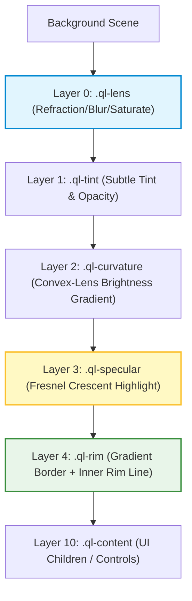

# 💧 QuickLiquid

[](https://www.npmjs.com/package/quick-liquid)
[](https://bundlephobia.com/package/quick-liquid)
[](https://github.com/amarnath3003/quickLiquid/blob/main/LICENSE)
[](https://github.com/amarnath3003/quickLiquid/pulls)

> **Ultra-optimized Liquid Glass UI Framework.** Replicate Apple’s premium "liquid glass" visual effect with native refraction distortion, real-time light physics, and fluid spring animations at 60+ FPS.

---

## 📸 The Rendering Stack

QuickLiquid achieves high-fidelity glass refraction by separating the visual layers and performing SVG-based lenticular coordinate warping on background pixels.



---

## ✨ Features

- **Exact Refraction (vector Snell's law):** the displacement field is ray-traced through a convex glass bezel — thickness, bezel width, and IOR are *physical* knobs, not art sliders. Full derivation in [PHYSICS.md](packages/quick-liquid/PHYSICS.md).
- **Apple-signature lighting:** two-lobe conic rim light (bright at the light angle and its mirror) + soft bezel sheen — not a generic glassmorphism fog.
- **Chromatic Aberration for free:** dispersion is a linear per-channel scale on one shared map — three `feDisplacementMap` scales, zero extra map generation.
- **Heavily optimized map generation:** 1-D LUT reduction (no per-pixel trig), bezel-band-only iteration, 4-fold symmetry, shared refcounted map cache — 0.3–5 ms per unique geometry, same-size elements share one map.
- **Minimal-loss encoding:** displacement maps are normalized to the full 8-bit range with `scale = 2·Δmax` + ordered dithering → quantization error ≈ 0.1 px, the theoretical minimum for 8-bit maps.
- **Water Droplet Merging (Metaballs):** seamlessly blend and morph adjacent glass elements on the fly.
- **React-First Integration:** full React wrapper with mount animations, jiggles, and gesture states.

---

## 🚀 Installation

```bash
npm install quick-liquid
```

---

## 🛠️ Usage

### ⚛️ React Integration

```tsx
import { LiquidGlass } from 'quick-liquid/react';

function Header() {
  return (
    <LiquidGlass
      config={{
        blur: 16,
        refractionStrength: 24,
        chromaticAberration: 0.1,
        dynamicLighting: true,
      }}
      liquidPress // scale + bounce on click
      animateIn={200} // fade/scale in after 200ms
      className="glass-navbar"
    >
      <nav>
        <span>Brand</span>
        <button>Dashboard</button>
      </nav>
    </LiquidGlass>
  );
}
```

### ⚡ Vanilla JS Integration

```javascript
import { LiquidGlassEngine } from 'quick-liquid';

const el = document.querySelector('.glass-card');
const engine = new LiquidGlassEngine(el, {
  blur: 20,
  saturation: 1.5,
  refractionStrength: 30,
  dynamicLighting: true
});

// Enable automatic liquid press physics
engine.enableLiquidPress({ scale: 0.92, squish: 0.03 });
```

---

## 🎨 Physics Presets

QuickLiquid ships with curated defaults matching premium Apple-quality rendering modes.

| Preset | Blur | Refraction | Saturation | Tint Opacity | Use Case |
| :--- | :--- | :--- | :--- | :--- | :--- |
| **Crystal Clear** | `0px` | `40` | `1.4` | `0.05` | High-end visual elements |
| **Frosted (Apple)** | `24px` | `18` | `1.8` | `0.15` | Default overlays and sheets |
| **Vivid Glass** | `12px` | `35` | `2.2` | `0.10` | Highly colorful dashboards |
| **Ultra Prismatic** | `8px` | `48` | `1.6` | `0.08` | Rich chromatic edge refraction |

---

## ⚙️ Configuration API

Configure the engine properties for the perfect balance of visual depth and rendering performance.

| Option | Type | Default | Description |
| :--- | :--- | :--- | :--- |
| `material` | `'clear' \| 'thin' \| 'regular' \| 'thick' \| 'ultra'` | — | Apple material preset (sets blur/tint/refraction together). |
| `refractionStrength`| `number` | `22` | **Max rim displacement in px.** The physical falloff shape comes from `thickness`/`bezelWidth`/`ior`. |
| `bezelWidth` | `number` | `34` | Width (px) of the curved bezel band where light bends. |
| `thickness` | `number` | `24` | Glass slab depth (px) — shapes the displacement falloff and the shadow. |
| `ior` | `number` | `1.5` | Index of refraction (1.4–1.6 = glass). |
| `chromaticAberration`| `number` | `0.3` | 0–1 → per-channel dispersion split at the bezel. |
| `blur` | `number` | `3` | Backdrop frost blur (px). `clear` ≈ 2, `regular` ≈ 14. |
| `saturation` | `number` | `1.5` | Backdrop saturation boost through the glass. |
| `lightAngle` | `number` | `-35` | Light direction in degrees (0 = top). |
| `edgeHighlight` | `number` | `0.9` | Crisp two-lobe rim ring intensity. |
| `specularStrength` | `number` | `0.42` | Soft bezel sheen intensity. |
| `fresnelPower` | `number` | `2.2` | Rim lobe tightness (1 wide … 5 tight). |
| `tint` / `tintOpacity` | `string` / `number` | `'255,255,255'` / `0.04` | Material tint. Keep ≤ 0.05 for clear glass. |
| `dynamicLighting` | `boolean`| `false` | Rim lobes follow the cursor. |
| `quality` | `'high' \| 'medium' \| 'low'` | `'high'` | Displacement map resolution cap (1024/384/128 px). |

**Browser notes:** the refraction path (`backdrop-filter: url()`) renders in Chromium; other engines gracefully fall back to frost + lighting. Two Chromium stacking pitfalls that silently disable refraction are documented in [VISUAL_QA_HANDOFF.md](VISUAL_QA_HANDOFF.md) — in short: never put `isolation`, `filter`, `opacity`, or `mask` on the glass host, and never give the lens layer an explicit `z-index`.

---

## 🌊 Advanced Animations

### Metaball Groups (Water Droplet Merging)

Create fluid glass blobs that combine automatically when they drift near each other:

```typescript
import { LiquidGroup, LiquidGesture } from 'quick-liquid';

const container = document.querySelector('.merge-container');
const group = new LiquidGroup(container, {
  mergeDistance: 60,
  blendRadius: 32,
});

document.querySelectorAll('.blob').forEach(blob => {
  group.add(blob);

  // Bind fluid drag animations
  const gesture = new LiquidGesture(blob);
  gesture.onDrag(() => group.updatePositions());
});
```

---

## 📄 License

Distributed under the MIT License. See `LICENSE` for more information.
