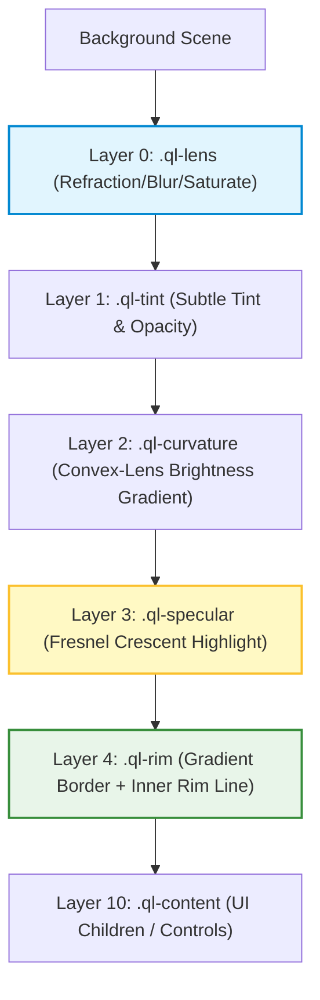

# 💧 QuickLiquid

[](https://www.npmjs.com/package/quick-liquid)
[](https://bundlephobia.com/package/quick-liquid)
[](https://github.com/amarnath3003/quickLiquid/blob/main/LICENSE)
[](https://github.com/amarnath3003/quickLiquid/pulls)

> **Ultra-optimized Liquid Glass UI Framework.** Replicate Apple’s premium "liquid glass" visual effect with native refraction distortion, real-time light physics, and fluid spring animations at 60+ FPS.

---

## 📸 The Rendering Stack

QuickLiquid achieves high-fidelity glass refraction by separating the visual layers and performing SVG-based lenticular coordinate warping on background pixels.



---

## ✨ Features

- **Real Refraction (Snell's Law):** Dynamic SVG coordinate warping simulating a real physical convex glass lens.
- **Dynamic Specular Lighting:** Elliptical Blinn-Phong crescent highlight and outer edge rims that follow your cursor.
- **Chromatic Aberration:** Per-channel RGB coordinate offsets for realistic light-splitting fringes.
- **Water Droplet Merging (Metaballs):** Seamlessly blend and morph adjacent glass elements on the fly.
- **Ultra High Performance:** Runs on hardware-accelerated CSS and optimized inline SVG data URIs.
- **React-First Integration:** Full React wrapper component supporting instant mount animations, jiggles, and gesture states.

---

## 🚀 Installation

```bash
npm install quick-liquid
```

---

## 🛠️ Usage

### ⚛️ React Integration

```tsx
import { LiquidGlass } from 'quick-liquid/react';

function Header() {
  return (
    <LiquidGlass
      config={{
        blur: 16,
        refractionStrength: 24,
        chromaticAberration: 0.1,
        dynamicLighting: true,
      }}
      liquidPress // scale + bounce on click
      animateIn={200} // fade/scale in after 200ms
      className="glass-navbar"
    >
      <nav>
        <span>Brand</span>
        <button>Dashboard</button>
      </nav>
    </LiquidGlass>
  );
}
```

### ⚡ Vanilla JS Integration

```javascript
import { LiquidGlassEngine } from 'quick-liquid';

const el = document.querySelector('.glass-card');
const engine = new LiquidGlassEngine(el, {
  blur: 20,
  saturation: 1.5,
  refractionStrength: 30,
  dynamicLighting: true
});

// Enable automatic liquid press physics
engine.enableLiquidPress({ scale: 0.92, squish: 0.03 });
```

---

## 🎨 Physics Presets

QuickLiquid ships with curated defaults matching premium Apple-quality rendering modes.

| Preset | Blur | Refraction | Saturation | Tint Opacity | Use Case |
| :--- | :--- | :--- | :--- | :--- | :--- |
| **Crystal Clear** | `0px` | `40` | `1.4` | `0.05` | High-end visual elements |
| **Frosted (Apple)** | `24px` | `18` | `1.8` | `0.15` | Default overlays and sheets |
| **Vivid Glass** | `12px` | `35` | `2.2` | `0.10` | Highly colorful dashboards |
| **Ultra Prismatic** | `8px` | `48` | `1.6` | `0.08` | Rich chromatic edge refraction |

---

## ⚙️ Configuration API

Configure the engine properties for the perfect balance of visual depth and rendering performance.

| Option | Type | Default | Description |
| :--- | :--- | :--- | :--- |
| `blur` | `number` | `24` | Backdrop blur radius in pixels. |
| `refractionStrength`| `number` | `18` | Distortion amount (magnification & edge displacement). |
| `saturation` | `number` | `1.8` | Background color saturation multiplier through the glass. |
| `chromaticAberration`| `number` | `0.05` | RGB separation strength at refracting corners. |
| `dynamicLighting` | `boolean`| `false` | Dynamically align specular crescent to follow cursor position. |
| `ior` | `number` | `1.45` | Index of Refraction for Snell's law gradient. |
| `edgeHighlight` | `number` | `0.4` | Brightness of the glass edge and outer rim border. |
| `specularStrength` | `number` | `0.3` | Intensity of the primary Blinn-Phong crescent highlight. |
| `tint` | `string` | `'255,255,255'`| RGB value for glass internal tinting. |
| `tintOpacity` | `number` | `0.15` | Opacity of the tint layer. |
| `quality` | `'high' \| 'medium' \| 'low'` | `'high'` | Resolution multiplier of the generated SVG refraction maps. |

---

## 🌊 Advanced Animations

### Metaball Groups (Water Droplet Merging)

Create fluid glass blobs that combine automatically when they drift near each other:

```typescript
import { LiquidGroup, LiquidGesture } from 'quick-liquid';

const container = document.querySelector('.merge-container');
const group = new LiquidGroup(container, {
  mergeDistance: 60,
  blendRadius: 32,
});

document.querySelectorAll('.blob').forEach(blob => {
  group.add(blob);

  // Bind fluid drag animations
  const gesture = new LiquidGesture(blob);
  gesture.onDrag(() => group.updatePositions());
});
```

---

## 📄 License

Distributed under the MIT License. See `LICENSE` for more information.
