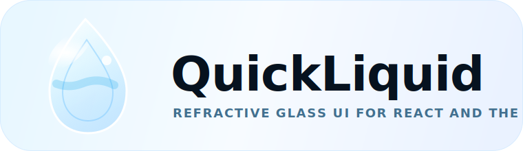

<p align="center">
  
</p>

<p align="center">
  <a href="https://www.npmjs.com/package/quick-liquid"></a>
  <a href="https://bundlephobia.com/package/quick-liquid"></a>
  <a href="https://www.npmjs.com/package/quick-liquid"></a>
  <a href="LICENSE"></a>
</p>

<p align="center">
  <b>Apple-style liquid glass for React and vanilla JavaScript.</b><br />
  Real SVG backdrop refraction, physical rim lighting, chromatic dispersion, spring gestures, and droplet-style merge animations.
</p>

<p align="center">
  <a href="https://quickliquid.vercel.app"><b>Live demo</b></a>
  &middot;
  <a href="packages/quick-liquid/PHYSICS.md"><b>Physics notes</b></a>
  &middot;
  <a href="ROADMAP.md"><b>Roadmap</b></a>
  &middot;
  <a href="https://www.npmjs.com/package/quick-liquid"><b>npm</b></a>
</p>

---

## Why QuickLiquid

QuickLiquid is a small UI effects engine for building premium refractive surfaces: nav bars, command palettes, tab indicators, floating controls, cards, sheets, and glassy buttons. It works as a React component or as a framework-free DOM engine.

<table>
  <tr>
    <td width="33%">
      <p align="center"></p>
      <b>Real refraction</b><br />
      SVG displacement maps bend the backdrop through a convex glass bezel instead of faking the look with a flat translucent layer.
    </td>
    <td width="33%">
      <p align="center"></p>
      <b>Liquid response</b><br />
      Press, bounce, jiggle, drag, mount, exit, and tab transitions use spring-based motion primitives.
    </td>
    <td width="33%">
      <p align="center"></p>
      <b>Built for reuse</b><br />
      Same-size glass elements share one refcounted displacement map, and strength changes update filter attributes without rebuilding maps.
    </td>
  </tr>
  <tr>
    <td width="33%">
      <p align="center"></p>
      <b>Chromatic edges</b><br />
      Red, green, and blue channels can refract at slightly different scales for realistic prismatic rims.
    </td>
    <td width="33%">
      <p align="center"></p>
      <b>Droplet merging</b><br />
      Grouped elements can form smooth metaball bridges as they approach each other.
    </td>
    <td width="33%">
      <p align="center"></p>
      <b>Graceful fallback</b><br />
      Chromium gets full SVG backdrop refraction. Other engines keep the frost, tint, shadow, and lighting layers.
    </td>
  </tr>
</table>

## Install

```bash
npm install quick-liquid
```

Requirements:

- Node 18+ for local builds
- React 18+ only if you use `quick-liquid/react`
- No stylesheet import required

## Quick Start

### React

```tsx
import { LiquidGlass } from 'quick-liquid/react';

export function CommandButton() {
  return (
    <LiquidGlass
      config={{
        material: 'regular',
        borderRadius: 24,
        dynamicLighting: true,
        chromaticAberration: 0.22,
      }}
      liquidPress={{ scale: 0.92, squish: 0.03 }}
      animateIn={120}
      className="command-glass"
    >
      <button type="button">Open Command Center</button>
    </LiquidGlass>
  );
}
```

### Vanilla DOM

```ts
import { LiquidGlassEngine } from 'quick-liquid';

const card = document.querySelector<HTMLElement>('[data-liquid-card]');

if (card) {
  const glass = new LiquidGlassEngine(card, {
    material: 'clear',
    refractionStrength: 28,
    dynamicLighting: true,
    quality: 'high',
  });

  glass.enableLiquidPress({ scale: 0.94, squish: 0.025 });
}
```

## Material Presets

Start with a material and override only the knobs you need.

| Preset | Feel | Good for |
| --- | --- | --- |
| `clear` | Low blur, stronger lensing | Hero controls, dock-like UI, colorful backgrounds |
| `thin` | Light frost, readable refraction | Toolbars, small buttons, chips |
| `regular` | Balanced frost and depth | Cards, nav bars, command palettes |
| `thick` | More blur and tint | Sheets, overlays, text-heavy surfaces |
| `ultra` | Softest, most opaque | Large panels and modal backgrounds |
| `adaptive` | Balanced preset with adaptive tint hook | Apps that feed their own environment color |

```ts
const config = {
  material: 'regular',
  blur: 18,
  refractionStrength: 20,
  tintOpacity: 0.08,
};
```

## Configuration

| Option | Type | Default | Description |
| --- | --- | --- | --- |
| `material` | `'clear' \| 'thin' \| 'regular' \| 'thick' \| 'ultra' \| 'adaptive'` | unset | Applies a curated glass preset. Explicit values override preset values. |
| `blur` | `number` | `3` | Backdrop frost blur in CSS pixels. |
| `saturation` | `number` | `1.5` | Backdrop saturation boost through the glass. |
| `tint` | `string` | `'255, 255, 255'` | RGB tint string. |
| `tintOpacity` | `number` | `0.04` | Material tint opacity. |
| `refractionStrength` | `number` | `22` | Maximum rim displacement in CSS pixels. |
| `bezelWidth` | `number` | `34` | Width of the curved refractive bezel band. |
| `thickness` | `number` | `24` | Virtual glass slab depth. |
| `ior` | `number` | `1.5` | Index of refraction. |
| `chromaticAberration` | `number` | `0.3` | Per-channel dispersion amount from `0` to `1`. |
| `lightAngle` | `number` | `-35` | Light direction in degrees. |
| `edgeHighlight` | `number` | `0.9` | Rim highlight intensity. |
| `specularStrength` | `number` | `0.42` | Soft bezel sheen intensity. |
| `fresnelPower` | `number` | `2.2` | Rim lobe sharpness. |
| `hoverLighting` | `boolean` | `false` | Brightens the rim on hover. |
| `cursorTracking` | `boolean` | `false` | Lets the rim light follow the pointer. |
| `dynamicLighting` | `boolean` | `false` | Alias that enables cursor-driven lighting. |
| `parallax` | `boolean` | `false` | Adds subtle pointer parallax. |
| `elevation` | `number` | `1` | Shadow or ambient glow multiplier. |
| `borderRadius` | `number` | `28` | Glass corner radius in CSS pixels. |
| `quality` | `'high' \| 'medium' \| 'low'` | `'high'` | Displacement map resolution tier. |
| `refractionMode` | `'auto' \| 'svg' \| 'css'` | `'auto'` | Choose full SVG refraction or CSS-only fallback. |
| `appearance` | `'light' \| 'dark' \| 'auto'` | `'auto'` | Adapts tint, lighting, and shadow for light or dark backdrops. |
| `backdropLuminance` | `number` | unset | Optional `0..1` luminance hint for custom backdrop sampling. |

## Animation API

QuickLiquid exports the glass engine plus reusable animation primitives from `quick-liquid`.

```ts
import {
  LiquidButton,
  LiquidDrag,
  LiquidGesture,
  LiquidGroup,
  LiquidTabBar,
  Spring,
} from 'quick-liquid';
```

### Liquid buttons

```ts
import { LiquidButton } from 'quick-liquid';

const button = document.querySelector<HTMLElement>('.glass-button');

if (button) {
  new LiquidButton(button).onTap(() => {
    console.log('Tapped');
  });
}
```

### Merging groups

```ts
import { LiquidGroup, LiquidGesture } from 'quick-liquid';

const container = document.querySelector<HTMLElement>('.dock');
const items = document.querySelectorAll<HTMLElement>('.dock-item');

if (container) {
  const group = new LiquidGroup(container, {
    mergeDistance: 60,
    blendRadius: 28,
  });

  items.forEach((item) => {
    group.add(item);
    new LiquidGesture(item).onDrag(() => group.updatePositions());
  });
}
```

### Liquid tab indicators

```ts
import { LiquidGlassEngine, LiquidTabBar } from 'quick-liquid';

const nav = document.querySelector<HTMLElement>('.tabs');
const tabs = [...document.querySelectorAll<HTMLElement>('.tab')];

if (nav && tabs.length) {
  const tabBar = new LiquidTabBar(nav, tabs, { spring: 'snappy' });

  new LiquidGlassEngine(tabBar.getIndicator(), {
    material: 'clear',
    borderRadius: 999,
  });

  tabs.forEach((tab, index) => {
    tab.addEventListener('click', () => tabBar.select(index));
  });
}
```

## Import Map

| Import | Exports |
| --- | --- |
| `quick-liquid` | `LiquidGlassEngine`, `DEFAULT_CONFIG`, `MATERIAL_PRESETS`, springs, gestures, transitions, morphing, groups, tab bar utilities |
| `quick-liquid/react` | `LiquidGlass`, `LiquidGlassProps`, `LiquidGlassRef` |

## Browser Notes

The full refraction path depends on `backdrop-filter: url(...)`, which currently works in Chromium-based browsers. Safari and Firefox receive a CSS fallback with blur, saturation, tint, lighting, and shadow.

For Chromium refraction, avoid these styles on the glass host element because they can prevent the browser from resolving the live backdrop:

- `isolation`
- `filter`
- `opacity`
- `mask`
- explicit stacking changes on the internal lens layer

See [VISUAL_QA_HANDOFF.md](VISUAL_QA_HANDOFF.md) for the visual QA notes and known stacking pitfalls.

## Performance Model

QuickLiquid is designed around a cache-first rendering path:

- A 1-D lookup table reduces the physical refraction calculation.
- Only the rounded bezel band is iterated when generating displacement maps.
- Same-geometry elements share a refcounted map.
- `refractionStrength` and chromatic aberration updates only change SVG filter scale attributes when geometry is unchanged.
- `quality: 'medium'` or `quality: 'low'` can be used for dense lists or background UI.

You can read live engine metrics:

```ts
const metrics = glass.getPerformanceMetrics();

console.log(metrics.mapGenMs, metrics.mapPixelsComputed);
```

## Local Development

```bash
npm install
npm run typecheck
npm run build:lib
npm run dev
```

Useful workspace scripts:

| Command | What it does |
| --- | --- |
| `npm run dev` | Starts the demo workspace. |
| `npm run dev:landing` | Starts the landing/docs site. |
| `npm run dev:compare` | Starts the comparison app. |
| `npm run typecheck` | Type-checks `packages/quick-liquid`. |
| `npm run build:lib` | Builds the library package with tsup. |
| `npm run build` | Builds the library, demo, and landing site. |

## Documentation

- [Package README](packages/quick-liquid/README.md)
- [Physics notes](packages/quick-liquid/PHYSICS.md)
- [Optimization notes](packages/quick-liquid/OPTIMIZATION.md)
- [Visual QA handoff](VISUAL_QA_HANDOFF.md)
- [Roadmap](ROADMAP.md)

## License

MIT. See [LICENSE](LICENSE).
